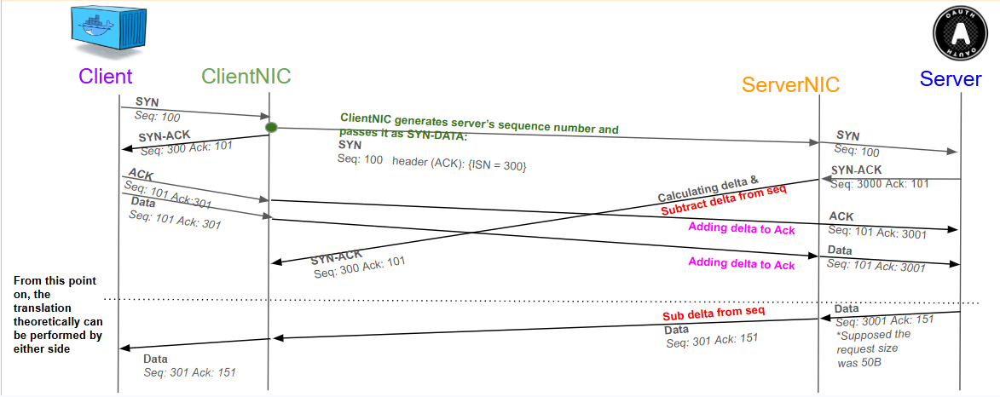

# zero-rtt-tcp

Proof-of-concept demonstrating **0-RTT TCP** — eliminating the 3-way handshake latency by using intelligent middleware (ClientNIC) that spoofs server SYN-ACKs, allowing clients to send application data immediately without waiting for the real handshake to complete (~50-200ms saved per connection).

**Educational/demo use only. Not suitable for production.**

📄 **[Results report — does the middlebox actually make connections faster?](https://claude.ai/code/artifact/882a2717-0bee-4c21-ba06-23f50921341a)**
— measured 0-RTT vs plain TCP under a 100 ms emulated WAN, and why the WAN's placement decides
the answer. Offline copy: [`docs/index.html`](docs/index.html) (open it locally, or enable GitHub
Pages on `docs/` to serve it).

🗺️ **[Architecture map](https://claude.ai/code/artifact/d6523fae-e687-4ceb-8477-fad152e75b72)**
— interactive explorer of all 15 components across 5 tracks (live data plane, harness, outputs,
deprecated code, BlueField), traced from the repo via `graphify`.

## Key Results

Pooled across twelve runs per stack (24,000 flows/side, 3 separately deployed stacks, 2026-08-08/08-11/08-17). 2000 connections, 500/s, 1 KB, 100 ms modelled RTT on the ClientNIC↔ServerNIC leg only.

| Mean | Plain TCP | 0-RTT | Difference |
|------|-----------|-------|------------|
| Time app is blocked in `connect()` before it can send data | 101.559 ms | 0.262 ms | **−101.30 ms** |
| Time until the connection fully completes (flow completion time) | 202.816 ms | 100.762 ms | **−102.05 ms** |
| Flows completed | 24,000/24,000 | 24,000/24,000 | — |

- Saving holds through median, 99th percentile, and worst case — not just the mean.
- **Condition**: each NIC must sit beside its own endpoint, with the modelled distance on the ClientNIC↔ServerNIC leg. Delay charged to either endpoint's link cancels the completion-time gain exactly, because the ServerNIC's buffer only releases when the real SYN-ACK arrives.
- **Not demonstrated**: 100k-connection scale — both stacks fail (plain TCP 99,728/100k, 0-RTT 87,073/100k, both fail their metric check), root cause unresolved. Throughput, TCP options (SACK/timestamps/window scaling), sustained concurrency (>~100 in-flight), and jitter/loss are all untested — see the full report for details.

Full write-up: [`docs/index.html`](docs/index.html) · methodology walkthrough: [`docs/results-review.html`](docs/results-review.html)

## Architecture

```
Client VM → ClientNIC VM → ServerNIC VM → Server VM
10.1.0.x     10.1.0.x        10.1.1.x      10.1.2.x
             (eth0/eth1)     (eth0/eth1)
```

| Component | Role |
|-----------|------|
| `src/clientnic/` | Core 0-RTT logic — intercepts SYN, sends spoofed SYN-ACK, stamps ISN in live DPDK mode |
| `src/servernic/` | Live DPDK mode: sole stateful translator (rewrites sequence numbers). Legacy Scapy mode: stateless forwarder |
| `experiments/` | Experiment scripts, test reports, and the client/server endpoints (`nodes/loadgen.py` — see `experiments/README.md`) |
| `infra/` | AWS CDK stacks that provision the 4-VM topology |

## Packet Flow

**ClientNIC has two implementations** — Scapy (Python, `src/clientnic/scapy/`, deprecated — feasibility PoC only) and DPDK (C, `src/clientnic/dpdk-forwarder/`, paired with the `src/servernic/dpdk/` translator, the live implementation) — both producing identical 0-RTT behavior.



**Key**: ClientNIC sends the spoofed SYN-ACK (④) before the real one (⑤) even arrives, so the client can send data (⑥) a full RTT earlier than normal TCP. The real SYN-ACK is dropped; sequence numbers are transparently rewritten (⑦, ⑩) so the server never knows.

## TCP Header Format

```
 0                   1                   2                   3
 0 1 2 3 4 5 6 7 8 9 0 1 2 3 4 5 6 7 8 9 0 1 2 3 4 5 6 7 8 9 0 1
+-+-+-+-+-+-+-+-+-+-+-+-+-+-+-+-+-+-+-+-+-+-+-+-+-+-+-+-+-+-+-+-+
|          Source Port         |       Destination Port       |
+-+-+-+-+-+-+-+-+-+-+-+-+-+-+-+-+-+-+-+-+-+-+-+-+-+-+-+-+-+-+-+-+
|                        Sequence Number                       |
+-+-+-+-+-+-+-+-+-+-+-+-+-+-+-+-+-+-+-+-+-+-+-+-+-+-+-+-+-+-+-+-+
|                    Acknowledgment Number                     |
+-+-+-+-+-+-+-+-+-+-+-+-+-+-+-+-+-+-+-+-+-+-+-+-+-+-+-+-+-+-+-+-+
|Length | Resv. |N|C|E|U|A|P|R|S|F|                             |
|       |       |S|W|C|R|C|S|S|Y|I|         Window Size         |
|       |       | |R|E|G|K|H|T|N|N|                             |
+-+-+-+-+-+-+-+-+-+-+-+-+-+-+-+-+-+-+-+-+-+-+-+-+-+-+-+-+-+-+-+-+
|            Checksum          |        Urgent Pointer         |
+-+-+-+-+-+-+-+-+-+-+-+-+-+-+-+-+-+-+-+-+-+-+-+-+-+-+-+-+-+-+-+-+
|                Options                      |    Padding      |
+-+-+-+-+-+-+-+-+-+-+-+-+-+-+-+-+-+-+-+-+-+-+-+-+-+-+-+-+-+-+-+-+
```

The fields this project's translation logic touches directly: **Sequence Number** (rewritten server→client by `+= delta`), **Acknowledgment Number** (rewritten client→server by `-= delta`, and used by ClientNIC to stamp the spoofed ISN `V` in live DPDK mode), and **Checksum** (recalculated after every rewrite — see below).

## Sequence Number Translation

ClientNIC maintains a flow table with a per-connection `seq_delta`:

```
delta = spoofed_server_isn - real_server_isn   (mod 2^32)

client→server packets:  TCP.seq += delta
server→client packets:  TCP.ack -= delta
```

After rewriting, checksums are recalculated — automatically by Scapy (`del pkt[IP].chksum`), or explicitly in C via DPDK's `rte_ipv4_cksum()` / `rte_ipv4_udptcp_cksum()`.

## Infrastructure

Two AWS CDK stacks in `infra/`, both provisioning the same 4-VM chain topology in `eu-central-1`:

| Stack | ClientNIC data plane | Directory |
|-------|---------------------|-----------|
| Scapy | Python + Scapy (AF_PACKET) | `infra/scapy/` |
| DPDK | C + DPDK 23.11 ENA PMD | `infra/dpdk/` |

Both stacks share:
- **VPC** `10.1.0.0/16` with 3 public subnets: `Client` (`10.1.0.0/24`), `Middle` (`10.1.1.0/24`), `Server` (`10.1.2.0/24`)
- **4 EC2 instances** with source/dest check disabled on NIC VMs
- **SSM access** for all instances (no bastion or SSH key needed)
- **ip_forward=1** set persistently via sysctl.conf on NIC VMs at boot

```powershell
cd infra/dpdk      # or infra/scapy
.\deploy.ps1            # Creates venv, installs CDK deps, deploys
.\deploy.ps1 -Bootstrap # First-time CDK bootstrap + deploy
.\destroy.ps1           # Tear down all stacks
```

## Running the Tests

One entrypoint, two variables:
```bash
./experiments/run.sh                        # 0-RTT DPDK stack on AWS (STACK=0rtt, TRANSPORT=ssm)
STACK=baseline ./experiments/run.sh         # plain-TCP baseline on AWS (infra/baseline)
TRANSPORT=ssh ./experiments/run.sh          # 0-RTT on the university lab's static VMs, over SSH
```

`STACK` is `0rtt` (default) or `baseline`; `TRANSPORT` is `ssm` (default, AWS) or `ssh` (lab). The lab has no baseline stack, so `STACK=baseline TRANSPORT=ssh` is rejected. The script discovers the 4 VMs, pulls latest code, rebuilds if needed, starts services in the correct order, drives the load, captures packets and writes a report to `experiments/reports/<stack>/`. Exit code = number of failures.

### Load Generation

`experiments/nodes/loadgen.py` is the traffic generator — a single-thread asyncio
(epoll-driven) TCP client/server. The 0-RTT translation layer is traffic-agnostic;
these flows pass through ClientNIC unchanged.

iperf2 was the original generator and has been removed: `-P N` spawns N OS threads
(25k threads/process at this project's scale is not viable), and it had no arrival
pacing, so per-connection latency measured queueing rather than the network path.

**Manual run (DPDK stack):** node scripts, in startup order:

| Script | VM | What it does |
|--------|----|--------------|
| `experiments/nodes/server.sh` | Server | Starts one asyncio listener across the port range |
| `experiments/nodes/servernic.sh` | ServerNIC | Builds + starts `servernic-dpdk` (translator) |
| `experiments/nodes/clientnic.sh` | ClientNIC | Builds + starts `clientnic-dpdk-forwarder` |
| `experiments/nodes/client.sh` | Client | Auto-discovers server IP, drives load |

**Load knobs** (`experiments/lib/measure.sh` is the single source of truth):

| Knob | Default | Purpose |
|------|---------|---------|
| `LOAD_PARALLEL` | 100000 | Total TCP connections per round |
| `LOAD_PORTS` | 4 | Contiguous server ports the load is spread across |
| `LOAD_RATE` | 2000 conn/s | **Arrival pacing** — spreads SYNs so latency is measurable |
| `LOAD_BYTES` | 1024 | One segment, so flow completion time ≈ handshake + 1 RTT |
| `LOAD_CONCURRENCY` | 2000 | In-flight connection ceiling |
| `LOAD_TIMEOUT` | 1800 s | Must exceed `LOAD_PARALLEL / LOAD_RATE` |
| `NETEM_RTT_MS` | 100 | Emulated WAN RTT, applied on the **Server** egress only |

### Two experiments, not one

| Script | Question | Reads as |
|--------|----------|----------|
| `experiments/run.sh` | Does 0-RTT remove one RTT? | Latency — time the app is blocked in `connect()` before it can send data is the headline metric |
| `experiments/sweeps/stress.sh` | Where does the data plane break? | Capacity — establishment success rate and throughput only |
| `STACK=baseline experiments/run.sh` | What does plain TCP cost? | The comparison point; same knobs, same endpoint setup |

Fusing latency and capacity into one run answers neither: a burst makes every
latency sample queue-dominated, and a success rate depressed by endpoint resource
exhaustion says nothing about whether sequence-number translation is correct. See
`experiments/measurement-methodology-review.md`.

## Quick Start (manual, on the VMs)

Startup order: **Server → ServerNIC → ClientNIC → Client**

```bash
# 1. Server VM
./experiments/nodes/server.sh

# 2. ServerNIC VM — Scapy (deprecated, feasibility PoC only) or DPDK (translator, live)
setsid python3 src/servernic/scapy/main.py < /dev/null >> /tmp/servernic.log 2>&1 &   # Scapy
./experiments/nodes/servernic.sh                                                       # DPDK

# 3. ClientNIC VM — Scapy (deprecated) or DPDK (eth1 must already be bound to vfio-pci)
setsid python3 src/clientnic/scapy/main.py < /dev/null >> /tmp/clientnic.log 2>&1 &   # Scapy
./experiments/nodes/clientnic.sh                                                       # DPDK

# 4. Client VM
./experiments/nodes/client.sh
```

> All VMs: connect via `aws ssm start-session --target <instance-id> --region eu-central-1`

## Success Criteria

| Check | Expected |
|-------|----------|
| Connections | 3/3 succeed |
| Spoofed SYN-ACK | Arrives at client before real SYN-ACK |
| ISN delta | Non-zero, consistent across all packets |
| Checksums | Zero bad checksums on eth0 and eth1 |
| Flow table | delta logged for every connection |

## Constraints

- TCP only (no UDP, QUIC)
- Does not handle TCP options (timestamps, window scaling, SACK)
- No encryption or authentication — isolated/controlled environments only
- Assumes reliable network (no packet reordering)

## Technology Stack

| Layer | Scapy implementation | DPDK implementation |
|-------|---------------------|---------------------|
| Language | Python 3.8+ | C11 |
| Packet I/O | Scapy (AF_PACKET) | DPDK ENA PMD + AF_PACKET |
| Checksums | Scapy auto-recalc | `rte_ipv4_cksum()` / `rte_ipv4_udptcp_cksum()` |
| eth1 capture | `tcpdump` | Built-in `--server-pcap` pcap writer |

Infrastructure: AWS CDK v2 (Python), eu-central-1
